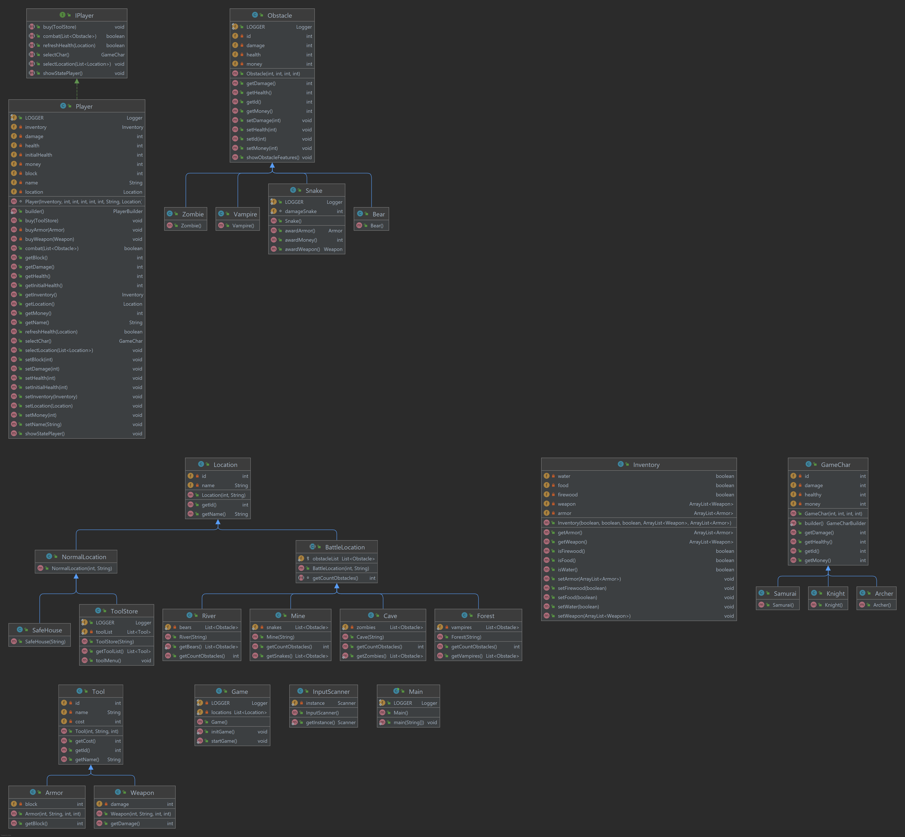

# patika-dev
Patika-Dev-TUBITAK

185. Tübitak Bilgem Java Bootcamp II [2.5]

## second-week
İleri seviye Git, Java 102
JAVA-17 ile yazılmıştır, Lombok , Log4j kütüphaneleri kullanılmaktadır. Proje Maven kullanılmıştır.
Bu ödevde tasarım, bana ait olup uml şekildeki gibidir.

